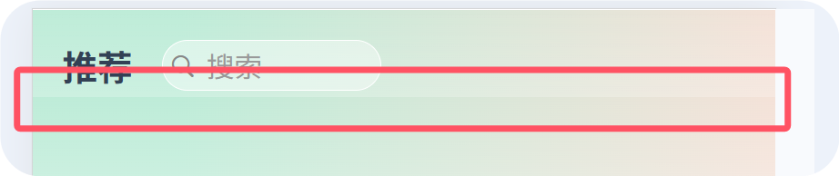

# 社团管理小程序开发
1. 小程序端看到顶部有一大块空白这是小程序自带的原生导航栏（也叫状态栏+导航栏）,会占据页面顶部空间。
解决方法就是:在页面的 pages.json 配置中，设置 navigationStyle: "custom"，隐藏原生导航，使用自定义导航栏
2. 导入scss文件中引入的色彩常量，需要在uni.scss中导入，页面布局的需要在APP.vue中导入
3.  已解决:将pageBg类放在最大的盒子上
4. 用户一进入小程序就让用户登录，通过微信登录拿到用户的基本信息
5. 之前创建了一个页面，但后面删除后编译微信小程序还是会出现报错
6. 消息界面的红点来源，是硬编码的形式写在代码中的
```
// 顶部标签导航栏的
   const tabs = ref([
     { name: '通知', badge: 5 },  // 硬编码为5个未读通知
     { name: '群聊', badge: 8 },  // 硬编码为8个未读消息
     { name: '申请管理', badge: isAdmin.value ? 2 : 0 }  // 管理员显示2个
   ])
   // 通知项上的来自通知对象的属性
      { 
        id: 1, 
        // ...其他属性
        isRead: false,  // false表示未读，显示红点
      }
	// 管理员快捷功能区的红点  
   const newApplicationCount = ref(2)  // 硬编码为2个新申请
   // 聊天群组的未读数，来自每个聊天群组的unredd属性
      { 
        id: 1,
        // ...其他属性
        unread: 5,  // 5条未读消息
      }
```
在request请求中，如果后端放回的状态码为401 就会清除token的值并跳转到登录页面